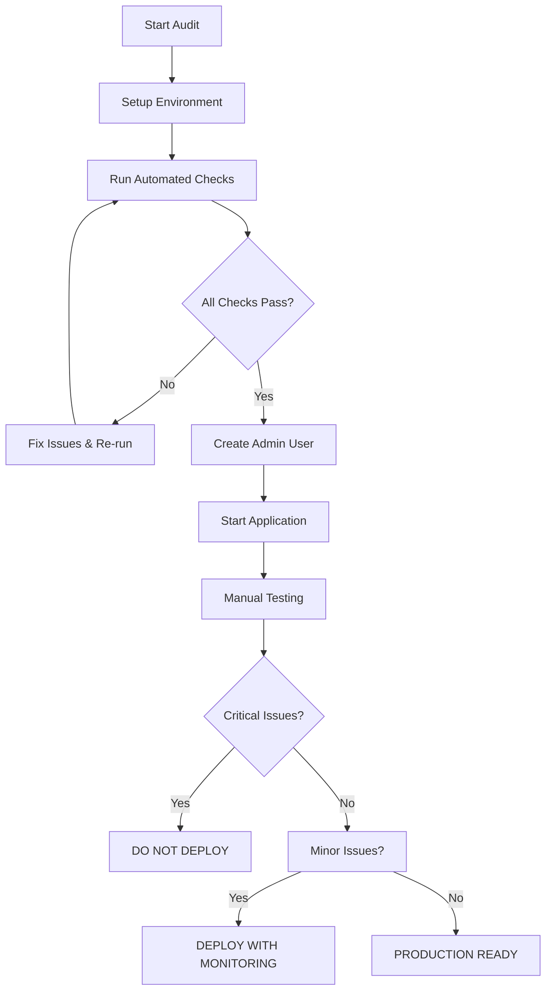

# 📋 **PRODUCTION AUDIT SUMMARY** - Restaurant Loyalty Platform

## **🎯 AUDIT OVERVIEW**

You now have a complete audit system to verify production readiness in **30 minutes**. This audit covers 9 tiers of testing from database security to end-to-end business flows.

---

## **📁 AUDIT DOCUMENTS CREATED**

| Document | Purpose | Usage |
|----------|---------|-------|
| `docs/PRODUCTION_TESTING_CHECKLIST.md` | **Comprehensive 402-line checklist** | Manual testing reference |
| `docs/AUDIT_EXECUTION_GUIDE.md` | **Detailed 2-hour audit guide** | Step-by-step instructions |
| `docs/QUICK_AUDIT_STEPS.md` | **30-minute quick audit** | Fast production readiness check |
| `scripts/audit-helper.js` | **Automated testing script** | Command-line audit automation |
| `docs/AUDIT_SUMMARY.md` | **This summary** | Overview and coordination |

---

## **🚀 HOW TO PERFORM THE AUDIT**

### **Option 1: Quick 30-Minute Audit (Recommended)**

```bash
# Follow this guide step-by-step
open docs/QUICK_AUDIT_STEPS.md

# Key steps:
1. Setup environment (5 min)
2. Run automated checks (10 min) 
3. Create admin user (2 min)
4. Start application (1 min)
5. Manual testing (12 min)
```

### **Option 2: Comprehensive 2-Hour Audit**

```bash
# For thorough testing before major releases
open docs/AUDIT_EXECUTION_GUIDE.md

# Covers all 9 tiers:
- Database foundation
- Authentication & authorization  
- Platform management
- Client operations
- POS functionality
- Edge functions
- User interface
- End-to-end flows
- Security testing
```

### **Option 3: Automated Checks Only**

```bash
# For quick verification during development
node scripts/audit-helper.js full-check

# Automated tests:
- Environment configuration
- Database connectivity
- Table structure
- Security functions
- Encryption/decryption
- RLS policy security
```

---

## **🔧 SETUP REQUIREMENTS**

### **Prerequisites**
- [ ] Supabase project running
- [ ] Environment variables configured
- [ ] Node.js and npm installed
- [ ] Browser with DevTools

### **Environment Setup**
```bash
# 1. Copy environment template
cp env.example .env

# 2. Configure Supabase credentials
# Get from: https://supabase.com/dashboard/project/YOUR_PROJECT/settings/api

# 3. Install dependencies
npm install
npm install chalk dotenv  # For audit helper
```

### **Required Environment Variables**
```env
VITE_SUPABASE_URL=https://YOUR_PROJECT.supabase.co
VITE_SUPABASE_ANON_KEY=your_anon_key_here
SUPABASE_SERVICE_ROLE_KEY=your_service_role_key_here
```

---

## **🛡️ SECURITY FIXES INCLUDED**

The audit system includes fixes for critical security issues:

### **Database Encryption**
- **File:** `sql/SIMPLE_ENCRYPTION_FIX.sql`
- **Fixes:** Vulnerable SHA256 hashing → Enterprise AES encryption
- **Functions:** `encrypt_sensitive_data()`, `decrypt_sensitive_data()`, `hash_sensitive_data()`, `verify_hashed_data()`

### **RLS Policy Security**
- **File:** `sql/FIX_CRITICAL_RLS_ISSUES.sql`  
- **Fixes:** Dangerous `WITH CHECK (true)` policies → Proper access controls
- **Features:** Audit trails, rate limiting, tenant validation

---

## **📊 AUDIT RESULTS INTERPRETATION**

### **✅ PRODUCTION READY**
- All automated checks pass (✅ green)
- Manual tests complete successfully
- No critical security issues found
- Core business flows work end-to-end

### **⚠️ DEPLOY WITH MONITORING**
- Automated checks pass
- Minor UI/UX issues present
- Performance could be optimized
- Non-critical features missing

### **❌ DO NOT DEPLOY**
- Encryption tests fail
- Cross-tenant data access possible
- RLS policies have security holes
- Core functionality broken

---

## **🎯 QUICK COMMAND REFERENCE**

```bash
# === AUTOMATED AUDIT ===
node scripts/audit-helper.js full-check      # Complete automated audit
node scripts/audit-helper.js check-security  # Security functions only
node scripts/audit-helper.js check-rls       # RLS policy check
node scripts/audit-helper.js create-admin    # Create super admin user

# === APPLICATION ===
npm run dev                                   # Start application
npm install                                   # Install dependencies

# === TROUBLESHOOTING ===
node scripts/audit-helper.js check-env       # Environment check
node scripts/audit-helper.js check-db        # Database connectivity
```

---

## **🚨 CRITICAL SECURITY CHECKPOINTS**

Before deploying to production, ensure:

### **Database Security**
- [ ] Encryption functions work correctly
- [ ] Sensitive data is encrypted at rest
- [ ] Password hashing uses bcrypt (not SHA256)
- [ ] Decryption capability exists for data recovery

### **Access Control**
- [ ] RLS policies prevent cross-tenant access
- [ ] No dangerous `WITH CHECK (true)` policies
- [ ] User roles are properly enforced
- [ ] Admin access is restricted

### **Data Protection**
- [ ] No sensitive data in browser console
- [ ] API calls require authentication
- [ ] Input validation prevents injection
- [ ] Audit trails capture critical actions

---

## **📞 TROUBLESHOOTING GUIDE**

### **Common Issues & Solutions**

| Issue | Solution |
|-------|----------|
| **"Cannot connect to database"** | Check `.env` file configuration |
| **"Security functions missing"** | Run `sql/SIMPLE_ENCRYPTION_FIX.sql` |
| **"RLS policies dangerous"** | Run `sql/FIX_CRITICAL_RLS_ISSUES.sql` |
| **"User creation failed"** | Use Supabase Dashboard → Authentication |
| **"Application won't start"** | Check `npm install` and environment |

### **Emergency Contacts**
- **Database Issues:** Check Supabase Dashboard status
- **Security Concerns:** Review `docs/RLS_SECURITY_ANALYSIS.md`
- **Deployment Problems:** See `docs/DEPLOYMENT_TROUBLESHOOTING.md`

---

## **📈 AUDIT WORKFLOW**



---

## **🏆 SUCCESS CRITERIA**

### **Minimum Requirements for Production**
1. **Security:** All encryption tests pass
2. **Access Control:** Cross-tenant isolation verified
3. **Functionality:** Core business flows work
4. **Performance:** Acceptable response times
5. **Monitoring:** Error handling works

### **Ideal Production State**
1. **Security:** Grade A security rating
2. **Performance:** Sub-2 second page loads
3. **Reliability:** 99.9% uptime capability
4. **Monitoring:** Comprehensive logging
5. **Documentation:** Complete user guides

---

## **📋 FINAL CHECKLIST**

Before marking as production ready:

- [ ] **Automated audit passes** (`node scripts/audit-helper.js full-check`)
- [ ] **Manual testing complete** (follow `docs/QUICK_AUDIT_STEPS.md`)
- [ ] **Security verified** (no critical vulnerabilities)
- [ ] **Performance acceptable** (page loads < 3 seconds)
- [ ] **Error handling works** (graceful failure modes)
- [ ] **Documentation updated** (deployment guides current)
- [ ] **Monitoring configured** (alerts for critical issues)
- [ ] **Backup strategy** (data recovery plan exists)

---

**🎯 GOAL: Use this audit system to confidently deploy secure, production-ready software in 30 minutes!**

---

## **📚 ADDITIONAL RESOURCES**

- **Security Analysis:** `docs/RLS_SECURITY_ANALYSIS.md`
- **Encryption Guide:** `docs/SECURITY_ENCRYPTION_GUIDE.md`
- **Deployment Help:** `docs/DEPLOYMENT_TROUBLESHOOTING.md`
- **Platform Access:** `PLATFORM_ACCESS.md`

**Happy auditing! 🚀** 